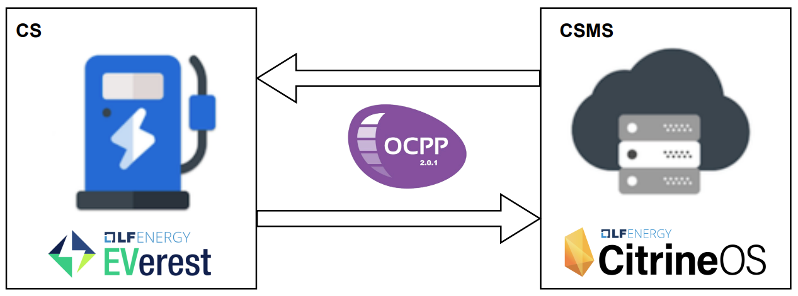
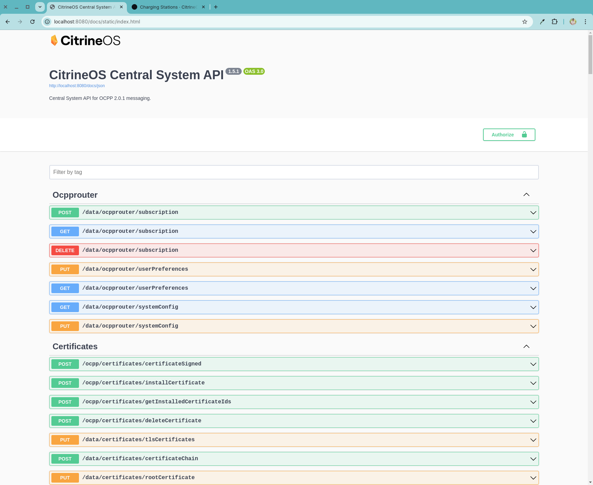
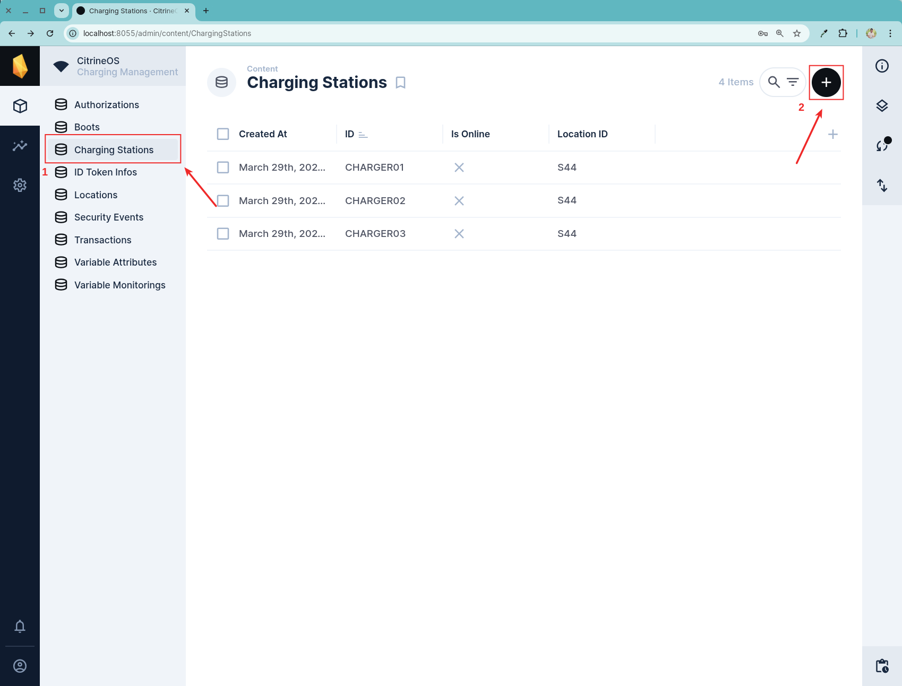
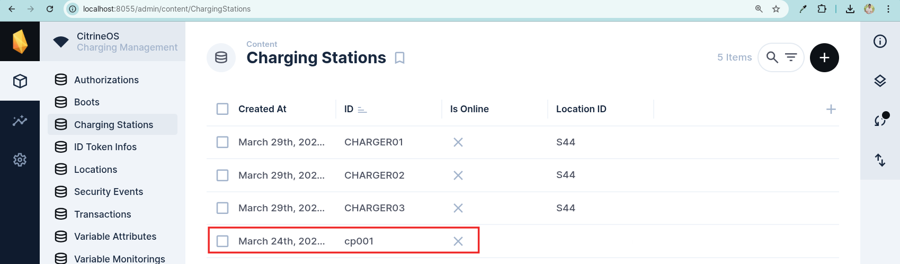
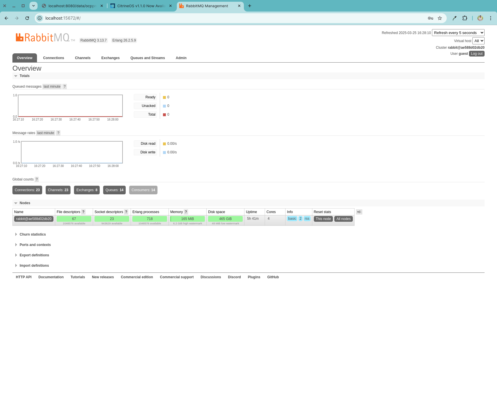
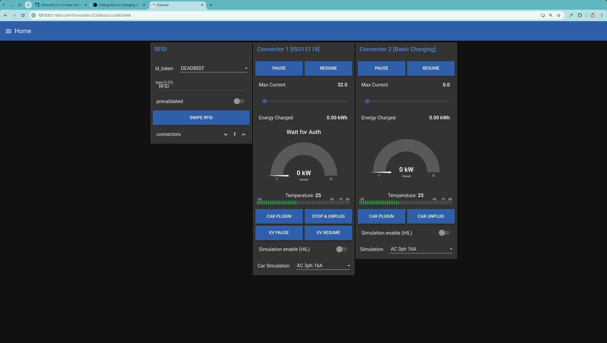

# CitrineOs and Everest connection Ocpp 2.0.1

**Everest:** EVerest is an open-source project under the LF Energy initiative that develops and maintains a modular software suite for electric vehicle (EV) charging stations. Its goal is to facilitate interoperability between various standards and use cases, enabling implementation on a wide range of devices, from home chargers to public fast-charging stations with support for both battery and solar power.
[Official Documentation](https://lfenergy.org/projects/everest/)

**CitrineOs:** CitrineOS is an open-source platform that offers software based on the Open Charge Point Protocol (OCPP) 2.0.1, enabling diverse actors, from electric vehicle enthusiasts to charging point operators, to efficiently manage and control charging infrastructures.
[Official Documentation](https://lfenergy.org/citrineos-v-1-1-0-now-available-adding-advanced-device-management-and-user-interface-support/)

The goal is to establish communication via the Ocpp2.0.1 protocol between a Charging Station (CS) using Everest and a Charging Station Management System (CSMS) using Citrioneos.



## Prerequisites
- Have installed and build [citrineos-core](https://github.com/citrineos/citrineos-core)
- Have installed and running everest-nucleus

## Setup password values of Citrineos app
Go to `Server` folder and export .env file:
```bash
source .env
```
Example you are exporting

```bash
# RabbitMQ
export RABBITMQ_USER=<RABBITMQ_USER>
export RABBITMQ_PASSWORD=<RABBITMQ_PASSWORD>
export RABBITMQ_HOST=<RABBITMQ_HOST>
export RABBITMQ_PORT=<RABBITMQ_PORT>

# PostgreSQL
export POSTGRES_DB=<POSTGRES_DB>
export POSTGRES_USER=<POSTGRES_USER>
export POSTGRES_PASSWORD=<POSTGRES_PASSWORD>
export POSTGRES_PORT=<POSTGRES_PORT>

# Directus webui
export DIRECTUS_KEY=<DIRECTUS_KEY>
export DIRECTUS_SECRET=<DIRECTUS_SECRET>
export DIRECTUS_ADMIN_EMAIL=<DIRECTUS_ADMIN_EMAIL>
export DIRECTUS_ADMIN_PASSWORD=<DIRECTUS_ADMIN_PASSWORD>
export DIRECTUS_TOKEN=<DIRECTUS_TOKEN>
```

Run the script to build the postgis image (database) for setup with env file data:

**Note:** Once the image is built, there's no need to run the script again.
```
./build-postgis.sh
```
This file internally runs the following command to create a new image. Check and remove that it's not using cache information and old information.

```bash
docker build --rm --no-cache --progress=plain \
-t ${REGISTRY_NAME}/${APP_NAME}:${APP_TAG} \
-f ./postgis/Dockerfile ./postgis || exit 1
```
after run the script you get:
```bash
$ docker images
REPOSITORY                                                                             TAG                         IMAGE ID       CREATED         SIZE
citrineos/postgis-custom                                                               1.1.0                        some-id       2 hours ago     610MB
```

<!-- To change the Postgres password, we had to create a custom image based on citrineos/postgis:v1.1.0. The only thing we added to the initialization files was a script that changes the password for the citrine user.
Since the citrineos/postgis:v1.1.0 image is also custom,

postgis folder tree
```bash
postgis
├── config
│   └── setup-user.sh
└── Dockerfile
```
Dockerfile:
```dockerfile
# Use the original base image
FROM citrineos/postgis:v1.1.0
# Scripts for the DB initialization
COPY config/setup-user.sh /docker-entrypoint-initdb.d/100-setup-user.sh
```
setup-user.sh:
```bash
#!/bin/bash
set -ex

# Wait until citrine user is ready
until pg_isready -U citrine; do
  sleep 1
done

# Change password
psql -v ON_ERROR_STOP=1 --username "$POSTGRES_USER" --dbname "$POSTGRES_DB" <<-EOSQL
    ALTER USER ${POSTGRES_USER} WITH PASSWORD '${POSTGRES_PASSWORD}';
EOSQL

``` -->

If you need to change password settings for Postgis and RabbitMQ services, you need to go to: [Server/src/config/envs/docker.ts](src/config/envs/docker.ts) and update. This file use `dotenv/config` library to upload environment variables.

```typescript
    data: {
      sequelize: {
        host: 'ocpp-db',
        port: process.env.POSTGRES_PORT ? parseInt(process.env.POSTGRES_PORT, 10) : undefined,
        database: process.env.POSTGRES_DB,
        dialect: 'postgres',
        username: process.env.POSTGRES_USER,
        password: process.env.POSTGRES_PASSWORD,
        storage: '',
        sync: false,
        alter: true,
      }

    messageBroker: {
        amqp: {
          url: `amqp://${process.env.RABBITMQ_USER}:${process.env.RABBITMQ_PASSWORD}@${process.env.RABBITMQ_HOST}:${process.env.RABBITMQ_PORT}`,
          exchange: 'citrineos',
        }
      }
```

## Usage
To start go to `citrineos-core/Server` and execute:

`docker compose -f docker-compose.yml up -d`

output:
```bash
cosi@cosi-pc:~/Documentos/datyra/citrineos-core/Server$ docker compose -f ./docker-compose.yml up -d
[+] Running 5/5
 ⠿ Network citrineos-net               Created                                                                                                                        0.7s
 ⠿ Container citrineos-postgis         Healthy                                                                                                                      167.5s
 ⠿ Container citrineos-rabbitmq        Healthy                                                                                                                      170.5s
 ⠿ Container citrineos-directus-webui  Healthy                                                                                                                      223.6s
 ⠿ Container citrineos-directus-core   Started
```

Now you could have access to:

<!--### Server Citrine

[http://localhost:8080/docs/static/index.html](http://localhost:8080/docs/static/index.html)

-->

### Create Charging Station

Go to [http://localhost:8055/admin](http://localhost:8055/admin) with this credentials:

**email**: <admin@citrineos.com>
**password**: CitrineOS!

Go to Chargin Stations option and add a new Charging Station then use
`ID: cp001` and `LocationID: 1`




You're going to get something like this



Now you have a Charging Station

## Stablish a connection with Everest

Now you have to setup Csms connection inside Everest-Nucleus.

First run `everest services start mqtt-server`

output:
```bash
docker@0b694f4b12e4:/workspace/everest-core/build/run-scripts$ everest services start mqtt-server
Starting service mqtt-server
WARN[0000] Found orphan containers ([everest-cpp_devcontainer-devcontainer-1 everest-cpp_devcontainer-docker-proxy-1]) for this project. If you removed or renamed this service in your compose file, you can run this command with the --remove-orphans flag to clean it up.
[+] Running 1/1
 ✔ Container everest-cpp_devcontainer-mqtt-server-1  Started
```

Update *ocppCsmsurl* attribute to `ws://172.17.0.1:8082` and *securityProfile* attribute to `1` into the file `internalCtrlr.json` located at:

```
everest-core/build/dist/share/everest/modules/OCPP201/component_config/standarized/internalCtrlr.json
```

```json
"properties":{
    "NetworkConecctionPofiles":{
        "attributes":[{
            "value":"[{\"ocppCsmsurl\":\"ws://172.17.0.1:8082, \"securityProfile\": 1}]"
        }],
        "default": "[{\\\"ocppCsmsUrl\\\": \\\"ws://172.17.0.1:8082\\\",\\\"securityProfile\\\": 1}}]\n""
    }
}
```
<!--### RabitMQ

[http://localhost:15672/](http://localhost:15672/)

**user**: guest **password**: guest

-->
### Create a password and an idToken in directus service

A password and an ID token are required to establish communication between a charging station (Everest) and a Central System (CitrineOs).
This allows us to maintain controlled communication and limit access to charging stations that can connect.

[Connecting a Charger using a password-Official Documentation](https://citrineos.github.io/latest/core-concepts/connecting-a-charger/)

[Adding ID Tokens-Official Documentation](https://citrineos.github.io/latest/core-concepts/adding-id-tokens/)

The password we'll use is the one defined in the Everest project in the following path:

Inside `nucleus` project go to `Security.json` file to know the default password located at:

```
nucleus/everest-core/build/dist/share/everest/modules/OCPP201/component_config/standarized/SecurityCtrlr.json
```

This is the password, you can change it.

```json
"properties":{
    "BasicAuthPassword": {
        "attributes": [{"value":"*****************"}],
        "default": "****************"
    }
}
```

**We need to define this password in the charging station we already created.**

To ensure a secure system, a script was created to load this information.

You need to execute `setup.sh` file located at root of `citrineos-core` project, if you are not able to execute,add execution permissions.

Change permissions:
```
citrineos-core$ chmod +x setup.sh
citrineos-core$ ls -la *.sh
-rwxrwxr-x 1 user user 203 abr  3 13:30 setup.sh
```
Then run script:
```
citrineos-core$ ./setup.sh
```
<!--From a new linux terminal you have to execute the next command with following parammeters to create a new password in directus services.
`stationId:cp001`, `password:DEADBEEF`, `setOnCharger:true`.
```bash
curl --location --request POST 'localhost:8080/data/configuration/password?callbackUrl=csms.pro/api/notifications' \
--header 'Content-Type: application/json' \
--data '{
  "stationId": "cp001",
  "password": "DEADBEEF",
  "setOnCharger": true
}'
```

### Create an idToken

[Adding ID Tokens Official Documentation](https://citrineos.github.io/latest/core-concepts/adding-id-tokens/)

To create an idToken you have to execute the following command. You need to use this parammeters. `idToken:DEADBEEF`


```bash
curl --location --request PUT 'localhost:8080/data/evdriver/authorization?idToken=DEADBEEF&type=Central' \
--header 'Content-Type: application/json' \
--data '{
    "idToken": {
        "idToken": "DEADBEEF",
        "type": "Central"
    },
    "idTokenInfo": {
        "status": "Accepted"
    }
}'-->

Go to Everest project and run `run-sil-ocpp201.sh` file located at:
```
everest-core/build/run-scripts/run-sil-ocpp201.sh
```
and run

```bash
$ ./run-sil-ocpp201.sh
```

output:
```bash
2025-04-05 06:49:03.470045 [INFO] ocpp:OCPP201     :: Connecting to uri: ws://172.17.0.1:8082/cp001 with security-profile 1
2025-04-05 06:49:03.656445 [INFO] ocpp:OCPP201     :: LWS connect with info port: [8082] address: [172.17.0.1] path: [/cp001] protocol: [ocpp2.0.1]
2025-04-05 06:49:05.750035 [INFO] ocpp:OCPP201     :: OCPP client successfully connected to server
2025-04-05 06:49:06.113985 [INFO] ocpp:OCPP201     :: Received BootNotificationResponse: {
    "currentTime": "2025-04-05T06:49:06.098Z",
    "interval": 60,
    "status": "Accepted"
}
```

Now open a new terminal inside `everest-nucleus` and run `nodered-sil-two-evse.sh` script located at:
```
everest-core/build/run-scripts/nodered-sil-two-evse.sh
```

```bash
./nodered-sil-two-evse.sh
```

Go to:
[http://127.0.0.1:1880/ui](http://127.0.0.1:1880/ui)



- CAR PLUGING
- SWIF RFID

*check everest ouput*